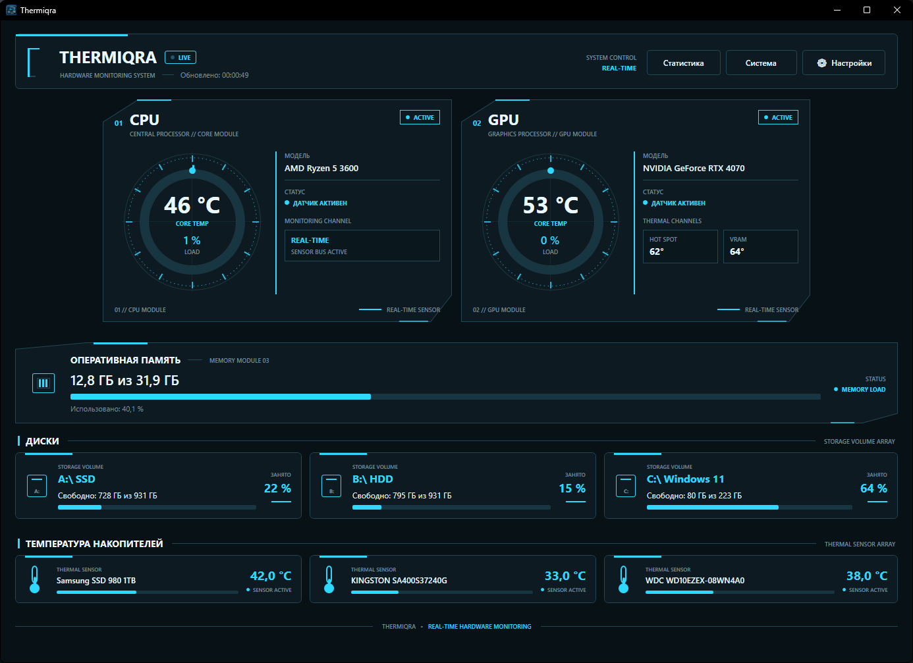
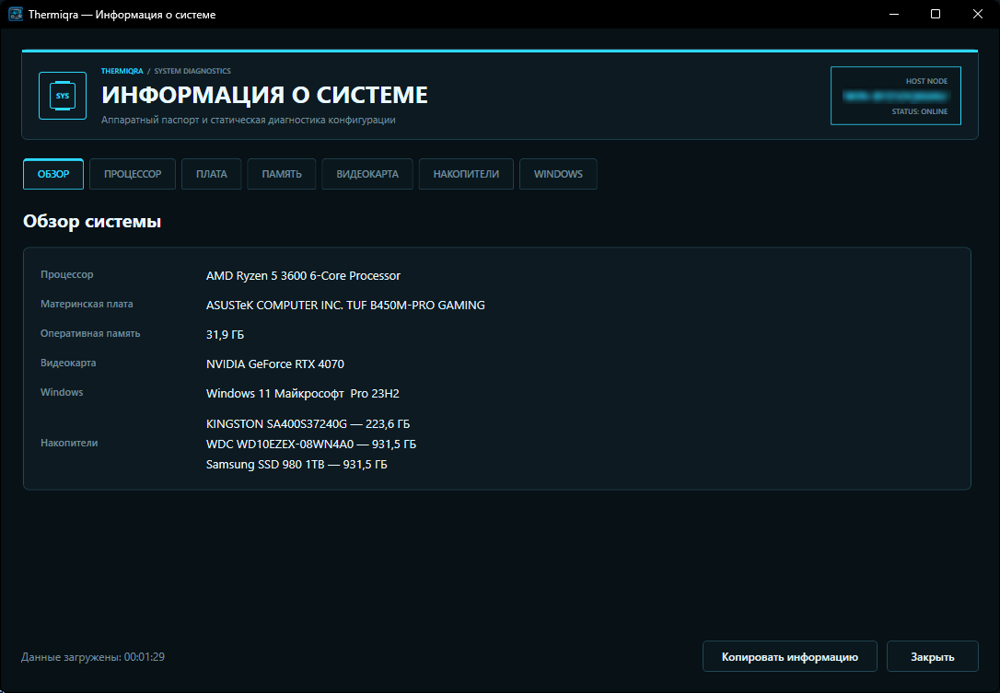
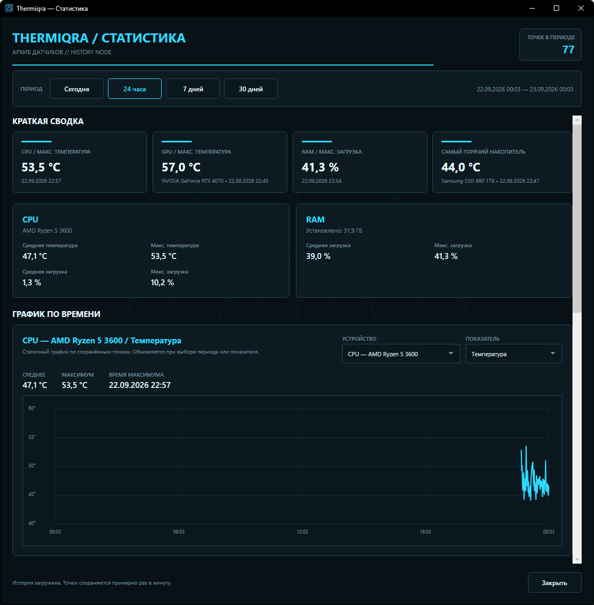
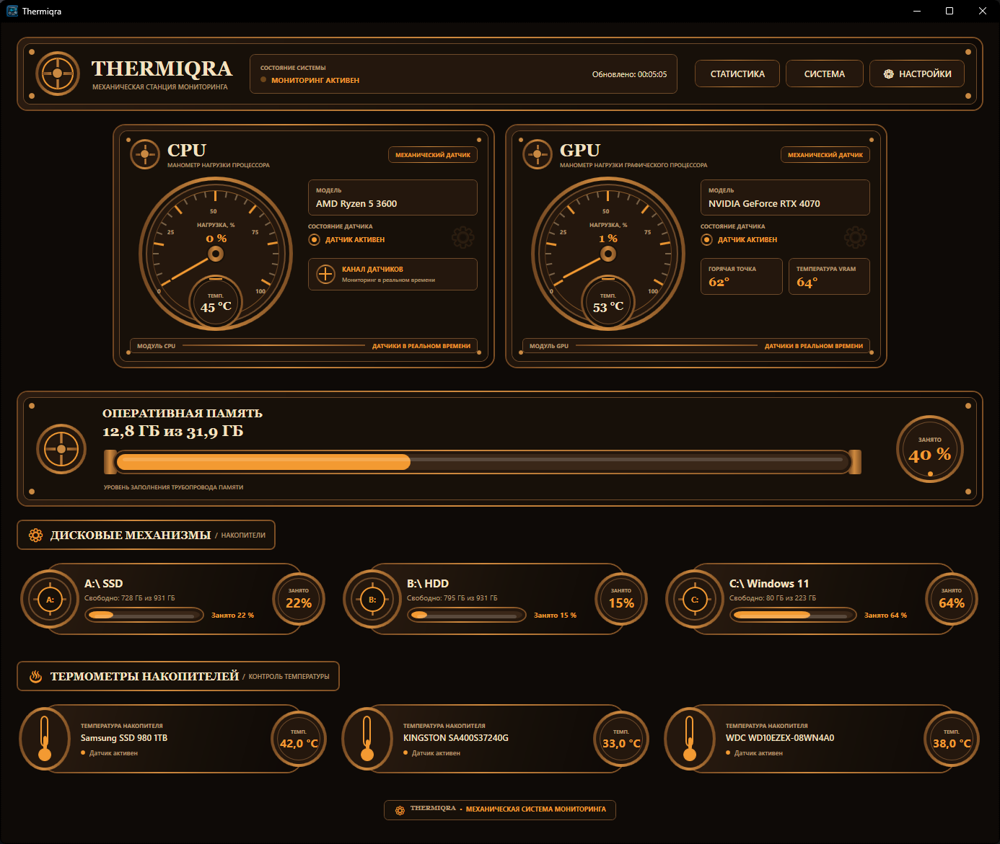

# Thermiqra

<p align="center">
  <strong>Real-time PC hardware monitoring, diagnostics, statistics and alerts for Windows 10/11.</strong>
</p>

<p align="center">
  <a href="https://github.com/grishachev/Thermiqra/releases/latest">
    
  </a>
  
  
  
</p>

<p align="center">
  
</p>

<p align="center">
  <a href="https://github.com/grishachev/Thermiqra/releases/latest"><strong>Download the latest Thermiqra release</strong></a>
</p>

Thermiqra is a native Windows desktop application for monitoring PC hardware in real time. It combines live CPU/GPU/RAM/storage data, detailed system information, memory diagnostics, local statistics, alerts, storage analysis, reporting and built-in updates in one application.

## Highlights

| Area | What Thermiqra provides |
| --- | --- |
| **Live monitoring** | CPU, GPU, RAM, physical storage and logical drive monitoring with one-second updates |
| **CPU threads** | Live load view for individual logical processors directly from the CPU monitor |
| **System information** | Detailed hardware and Windows information in a dedicated system view |
| **Memory diagnostics** | RAM module information, SPD data, JEDEC information, XMP 2.0 profiles, timings and upgrade information |
| **Storage analyzer** | Fast NTFS analysis through MFT, safe fallback analysis for other file systems, largest folders/files and cleanup recommendations |
| **Statistics** | Local SQLite history for Today, 24 hours, 7 days and 30 days, with charts, averages, maxima and timestamps |
| **Reports and export** | Technical diagnostic TXT report, raw statistics CSV export and visual HTML summary report with charts |
| **History analytics** | Period comparison, recent summaries and recurring warning analysis based on local monitoring history |
| **Hardware changes** | One-shot detection of meaningful hardware configuration changes |
| **Alerts** | Custom themed Warning/Critical/Info notifications, selectable sounds, configurable thresholds and Warning/Critical event history |
| **Themes** | Cyber Tech, SteamPunk, Frost Core and Military Ops |
| **Localization** | Full English and Russian interface with automatic System language mode |
| **Background operation** | System tray support, temperature tooltip and elevated autostart through Windows Task Scheduler |
| **Removable drives** | Connected removable USB volumes appear dynamically without restarting Thermiqra |
| **Updates** | In-app GitHub Release checks, progress display, SHA-256 verification, cancelable downloads and automatic installation |

## Screenshots

The screenshots are currently shown with the Russian interface. Thermiqra also includes a complete English localization.

### System information and statistics

<p align="center">
  
  
</p>

### Themes

Thermiqra includes four complete interface skins. The screenshot below shows the SteamPunk skin.

<p align="center">
  
</p>

## Current release — 0.8.1

Thermiqra 0.8.x expands the application with storage diagnostics, reporting, history analysis, removable-drive support and a more reliable automatic updater.

### What's included

- fast storage space analyzer
- fast NTFS analysis using MFT
- safe analysis for exFAT, FAT32 and other file systems
- largest folders and files with safe cleanup recommendations
- removable USB drives appear without restarting Thermiqra
- technical diagnostic TXT report
- statistics export to CSV
- visual HTML summary report with charts
- history analytics and period comparison
- hardware change detection
- improved system tray tooltip and themed context menu
- improved interface behavior and stability
- automatic update downloads can now be canceled correctly
- closing the update progress window cancels the download instead of leaving the application in a blocked state
- explicit **Cancel / Отмена** button in the update progress window
- the main Thermiqra window remains usable while an update is downloading

See the [Thermiqra 0.8.1 release page](https://github.com/grishachev/Thermiqra/releases/tag/v0.8.1) and the [Thermiqra 0.8.0 release page](https://github.com/grishachev/Thermiqra/releases/tag/v0.8.0) for release-specific notes.

## Memory diagnostics

Thermiqra's System Information view includes detailed RAM diagnostics where supported by the hardware and driver stack:

- installed memory modules and slot information
- SPD information
- JEDEC information
- XMP 2.0 profile detection
- SPD/XMP timing information
- occupied and available slot information for upgrades

> Thermiqra reports XMP profiles stored in SPD data. It does not claim that a specific XMP profile is currently active unless that state can be determined reliably.

## Statistics and history

Monitoring history is stored locally in SQLite. Thermiqra provides:

- Today / 24h / 7d / 30d periods
- CPU temperature and load history
- GPU temperature, load, Hot Spot and VRAM temperature when available
- RAM usage history
- per-device storage temperature history
- interactive historical charts
- average and maximum values with timestamps
- all-time hardware records
- Warning/Critical event history
- manual statistics clearing
- period comparison and history analytics
- CSV export and HTML summary reporting

## Storage analysis

Thermiqra includes a dedicated storage analyzer designed to inspect disk usage without deleting files automatically.

For NTFS volumes, Thermiqra can use a fast MFT-based analysis path. For exFAT, FAT32 and other supported file systems, it falls back to safe directory traversal.

The analyzer reports:

- logical and allocated file sizes
- file and directory counts
- largest folders
- largest files
- filesystem overhead where it can be determined
- safe cleanup recommendations

Removable USB volumes are detected dynamically and can be analyzed without restarting Thermiqra.

## Automatic updates

Thermiqra checks GitHub Releases for newer versions and can install them automatically.

When an update is accepted, Thermiqra downloads the matching installer, shows download progress, verifies the SHA-256 digest when GitHub provides one, starts the installer in silent mode and launches Thermiqra again after installation.

Starting with 0.8.1, the update download can be canceled safely. Closing the progress window or pressing **Cancel / Отмена** cancels the active download, and the main application remains usable.

Thermiqra 0.6.1 and 0.6.2 contain an older updater bug that can prevent automatic installation after the installer download completes. Users on those versions should install 0.6.3 or newer manually once. After that, future releases can use the corrected in-app update flow.

Users running Thermiqra 0.6.0 or earlier also need to install a newer release manually before using the in-app update flow.

## Localization

Thermiqra supports:

- **System** — Russian Windows uses Russian; other Windows UI languages use English
- **English**
- **Русский**

The main monitor, Settings, Statistics, System Information, tray menu, notifications and update interface are localized.

## Technology

- C# / WPF
- .NET 10
- LibreHardwareMonitorLib 0.9.6
- Microsoft.Data.Sqlite
- System.Management
- PawnIO
- Inno Setup

## System requirements

- Windows 10 or Windows 11
- x64 system
- administrator rights for installation and full hardware access
- PawnIO for supported low-level hardware access

## Build

Main project:

`PCHardwareMonitor/PCHardwareMonitor.csproj`

The Release build uses `win-x64` and self-contained publishing:

```powershell
dotnet publish .\PCHardwareMonitor\PCHardwareMonitor.csproj -c Release -r win-x64 --self-contained true -o .\PCHardwareMonitor\bin\Release\net10.0-windows\win-x64\publish
```

## Installer

Inno Setup script:

`Installer/Thermiqra.iss`

`PawnIO_setup.exe` is intentionally not stored in the repository. For a local installer build, place it at:

`Installer/Dependencies/PawnIO_setup.exe`

PawnIO is installed by the Thermiqra installer but is not automatically removed with Thermiqra because it may be used by other software.

## User data

Thermiqra stores user settings and local statistics in:

`%LocalAppData%\Thermiqra`

During uninstall, the user can choose whether to keep or remove Thermiqra settings and history.

## Project note

The public application name is **Thermiqra**. The internal project name and namespace currently remain `PCHardwareMonitor`.
